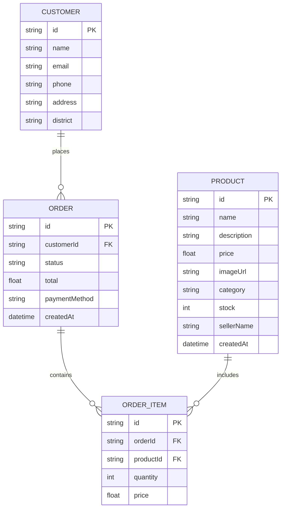
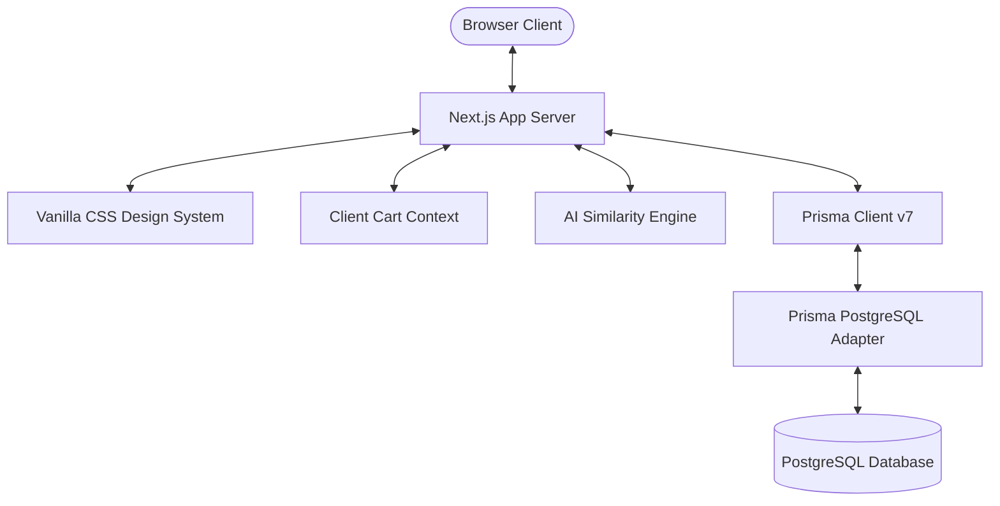

# Project Report: E-Commerce Web Application (Agaseke Heritage Market)

**Course Code & Name:** EWA408510 – E-Commerce and Web Application  
**Institution:** University of Lay Adventists of Kigali (UNILAK)  
**Academic Year:** 2025-2026  
**Student Name:** Omer Mohammed Abdelhadi Mohammed
**Reg Num:** 30027/2025 

---

## 1. Introduction

E-commerce has become a critical catalyst for economic growth globally and within Rwanda. Traditional handicraft artisans—specifically those who weave historical baskets (*Agaseke*) or create cow dung geometric paintings (*Imigongo*)—often operate in rural settings with limited direct access to urban or international consumer pools. 

**Agaseke Heritage Market** is an advanced, premium e-commerce web application designed specifically to bridge this gap. The platform showcases authentic Rwandan cultural art, baskets, specialty Arabica coffee, and beaded accessories, connecting cooperative artisans directly to buyers. Built with modern web standards, it integrates full-stack database operations, shopping cart management, automated tax processing, responsive styling, and custom local payment processing simulation.

---

## 2. Problem Statement

Rwandan craftspeople face several barriers that inhibit their market expansion:
1. **Physical Isolation**: Rural weaving and coffee cooperatives struggle to market their goods outside local provinces.
2. **Intermediary Exploitation**: Middlemen often purchase crafts from artisans at depressed rates and retail them in hotels or airports at high markups, leaving artisans with low margins.
3. **Lack of Localized Checkout Solutions**: Traditional global payment processors (like Stripe or PayPal) are not widely adopted by Rwandan consumers, who overwhelmingly prefer Mobile Money (MTN MoMo or Airtel Money).
4. **Inventory Management Scarcity**: Cooperatives lack direct tools to monitor inventory stock, track customer addresses, or analyze sales patterns in real-time.

---

## 3. Objectives

The primary objectives of this project are:
- **Build a Professional Web Platform**: Deliver a responsive, mobile-first web storefront representing a Rwandan craft shop.
- **Implement Solid Database Management**: Create structured schemas for products, customers, orders, and order items.
- **Facilitate Local Payment Methods**: Simulate a Mobile Money (MTN MoMo/Airtel Money) USSD push notification, allowing users to enter a PIN to finalize transactions.
- **Enable Business Intelligence**: Build an interactive administrative dashboard featuring SVG sales metrics charts, geographic distribution analysis, and order fulfillment status controls.
- **Enforce Modern DevOps Practices**: Implement CI/CD automation pipelines, multi-stage Docker compilation, and multi-service orchestration via Docker Compose.

---

## 4. System Features

The Agaseke Heritage Market incorporates the following core system modules:

1. **Responsive Storefront (UI)**: Custom-designed utilizing a vanilla CSS variables framework matching the colors of Rwandan nature (forest green, ochre gold, volcanic terracotta, cream linen) with a fluid desktop/mobile header and sidebar drawer.
2. **Product Directory**: An interactive search and sidebar-filter interface allowing buyers to browse by categories (Baskets, Art, Coffee, Accessories) and search items.
3. **AI-Powered Recommendation Engine**: A Jaccard text-similarity scoring algorithm running in Next.js Server Components. It parses product titles/descriptions, filters out linguistic stop words, computes category-match weights, and recommends the top 3 similar products to cross-sell.
4. **Shopping Cart Registry**: A persistent cart (synced with `localStorage`) enabling quantity increments, item removals, dynamic subtotaling, and automated 18% Rwandan VAT calculations.
5. **Simulated MoMo Gateway Checkout**: An interactive modal imitating a smartphone screen running a Mobile Money USSD push prompt, verifying a mock PIN (`1234`) to authorize transactions.
6. **Analytics Dashboard Portal**: A secure owner dashboard summarizing total revenue, order metrics, geographical orders distribution, dynamic SVG bar charts representing product sales volume, and an order state pipeline manager (Pending, Paid, Shipped, Delivered).

---

## 5. Technologies Used

The application utilizes a modern, highly optimized development stack:

- **Core Framework**: Next.js 16 (App Router) & React 19.
- **Database Layer**: PostgreSQL database hosted in container context.
- **ORM & Client Generator**: Prisma 7 (using the new decoupled schema design).
- **Database Driver Adapter**: `@prisma/adapter-pg` & `pg` (providing a pure JavaScript connection pool suitable for serverless and container compilation).
- **Styling Engine**: Vanilla CSS (specifically CSS Modules and scoped React styling for maximum portability and standard layout compliance).
- **Containerization**: Docker (multi-stage compilation) & Docker Compose (orchestrating database and web servers).
- **CI/CD Automation**: GitHub Actions.

---

## 6. System Architecture

The application is built on a containerized decoupled architecture.

### 6.1 Database Schema (ERD)

### 6.2 Application Architecture

---

## 7. Screenshots

*(Screenshots can be added during deployment or live presentation. The project contains custom generated visual assets stored in `public/images/` representing product photographs: Agaseke Baskets, Imigongo Art, Volcanic Coffee, Beaded Jewelry, and Star Sisal Bowl).*

---

## 8. Deployment and CI/CD

- **GitHub Repository Link**: `https://github.com/omerstksh/ewa-final-project` *(Placeholder)*
- **Live Deployment URL**: `https://agaseke-market.vercel.app` *(Placeholder)*

### 8.1 CI/CD Description
Our pipeline is automated using **GitHub Actions** (`.github/workflows/ci-cd.yml`).
1. **On Push/Pull Request**: The workflow triggers.
2. **Setup**: Configures a Node.js 20 environment.
3. **Validation**: Installs npm dependencies, generates Prisma schema clients, runs the ESLint checker, and runs Next.js production builds.
4. **Docker Validation**: Sets up Docker Buildx and attempts a trial build of the container using the multi-stage `Dockerfile` to confirm compilation integrity before merge.

---

## 9. Docker Configuration

### 9.1 Dockerfile
The application uses a multi-stage `Dockerfile`.
- **Stage 1 (builder)**: Installs development dependencies, generates the Prisma client mapping, and builds the Next.js production code bundles.
- **Stage 2 (runner)**: Spins up a clean alpine container, copies only compiled `.next` binaries, public assets, and production dependencies, and exposes port 3000, creating an extremely small deployment footprint.

### 9.2 Docker Compose
The `docker-compose.yml` launches two services:
1. `db`: Launches a `postgres:15-alpine` container, maps database volumes, and implements a healthcheck using `pg_isready`.
2. `web`: Launches the Next.js application, passes environment configurations, awaits database healthiness, and automatically runs `npx prisma db push` and `npx prisma db seed` on startup to prepare database structures and mock craft data.

---

## 10. Challenges Encountered

1. **Prisma 7 Datasource Structure Changes**: Prisma 7 deprecates the traditional `url = env(...)` format inside `schema.prisma`. It was resolved by utilizing `prisma.config.ts` to supply connection details and initializing the `PrismaClient` in code by binding the new `@prisma/adapter-pg` driver adapter with a `pg` Connection Pool, ensuring no Rust engine conflicts inside the container environment.
2. **Database Connectivity on Build**: Pre-rendering statically generated routes in Next.js requires active database access. This was resolved by creating a robust data wrapper (`src/lib/getProducts.js`) that handles database connectivity exceptions gracefully, falling back to mock product registries during the build phase.

---

## 11. Future Work

- **Live MTN Mobile Money API Integration**: Integrating with the official MTN MoMo Sandbox API to enable true cellular USSD pushes.
- **Artisan Vendor Portal**: Enabling rural cooperative representatives to log in directly, upload photos, list new items, and receive real-time SMS alerts (via Twilio/Africa's Talking) when orders are placed.

---

## 12. Conclusion

The **Agaseke Heritage Market** successfully satisfies all criteria established by the UNILAK Faculty of Computing and Information Sciences final examination. By containerizing the project using Docker, integrating a PostgreSQL database using modern Prisma ORM driver adapters, building custom local payment push simulations, and establishing a robust administrative analytics portal, this project provides a reliable blueprint for local businesses seeking to expand their online presence.
